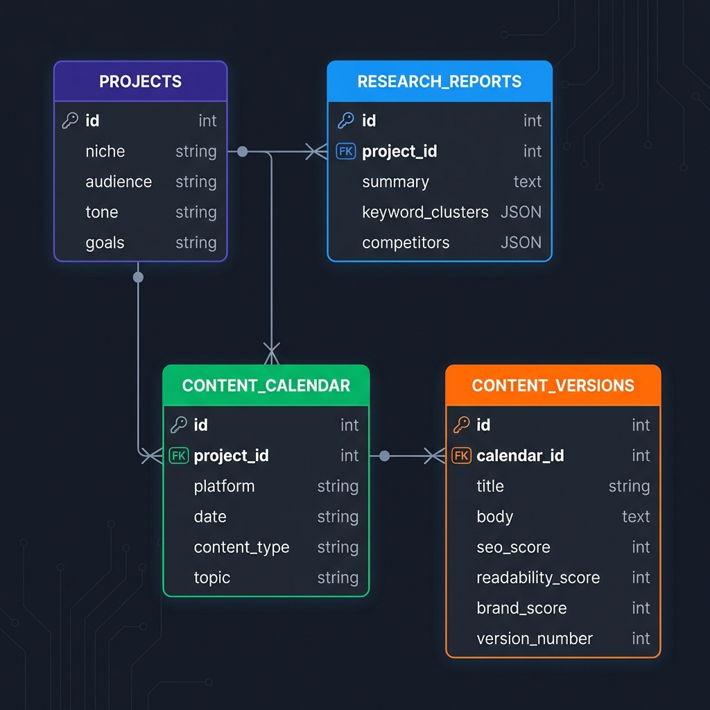
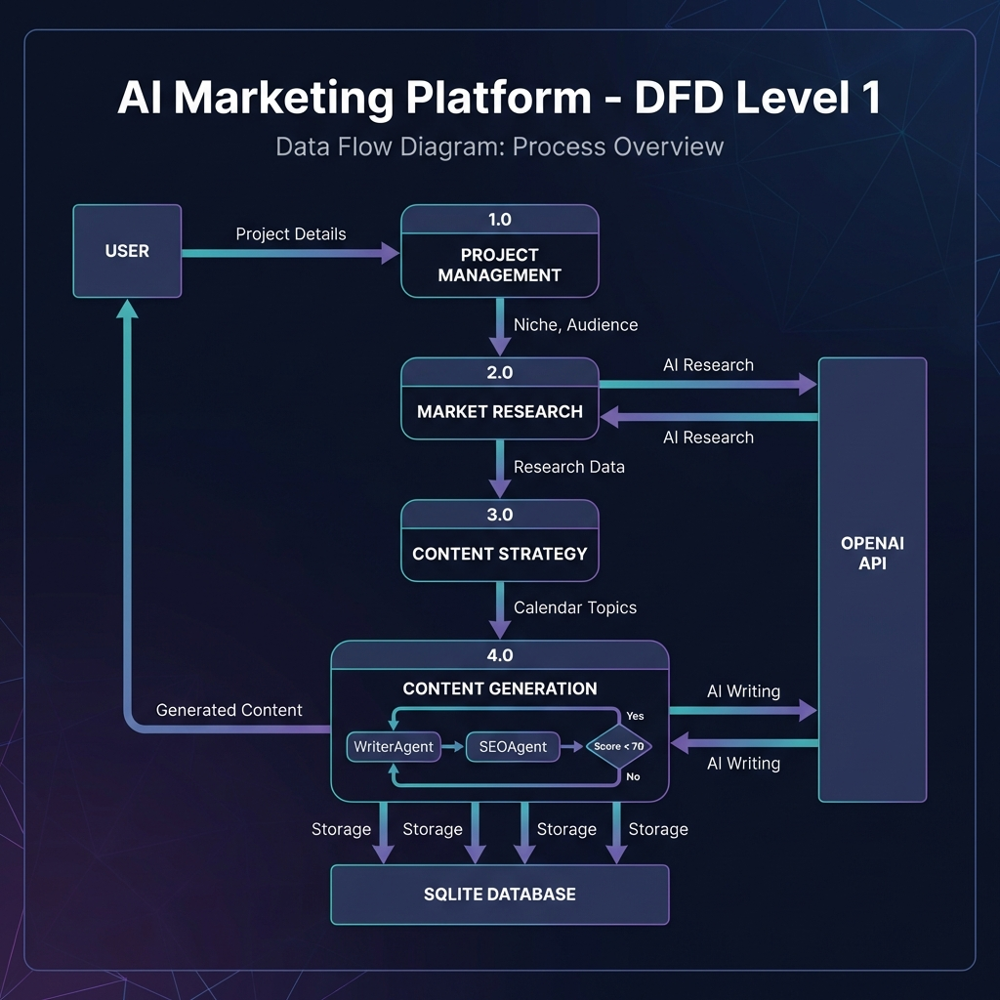

# Agentic AI Marketing Platform - Technical Documentation

## Database Schema (Entity-Relationship Diagram)



### Table Descriptions

| Table | Description |
|-------|-------------|
| **projects** | Stores brand/project information including niche, target audience, tone, and goals |
| **research_reports** | Stores AI-generated market research including summary, keywords, and competitor analysis |
| **content_calendar** | 14-day content schedule with platform, date, content type, and topic |
| **content_versions** | Generated content drafts with SEO, readability, and brand scores |

---

## Data Flow Diagram (DFD) - Level 1



### Process Descriptions

| Process | Description |
|---------|-------------|
| **1.0 Project Management** | Receives project details (niche, audience, tone, goals) from User |
| **2.0 Market Research** | Analyzes trends, competitors, and keywords via OpenAI API |
| **3.0 Content Strategy** | Generates 14-day content calendar based on research |
| **4.0 Content Generation** | Creates content with WriterAgent → SEOAgent feedback loop |

### Data Stores
- **SQLite Database**: Local file-based storage for all project data

### External Entities
- **User**: Provides project details, receives generated content
- **OpenAI API**: Provides AI research and content generation capabilities

---

## Agent Workflow

```
┌─────────────────┐
│   Orchestrator  │
└────────┬────────┘
         │
         ▼
┌─────────────────┐
│ MarketResearch  │──────► Research Report
│     Agent       │
└────────┬────────┘
         │
         ▼
┌─────────────────┐
│ ContentStrategy │──────► 14-Day Calendar
│     Agent       │
└────────┬────────┘
         │
         ▼
┌─────────────────┐     ┌─────────────┐
│   WriterAgent   │◄────│  SEOAgent   │
│   (creates)     │────►│  (scores)   │
└────────┬────────┘     └──────┬──────┘
         │                     │
         │   Score < 70?       │
         │◄────────────────────┘
         │
         ▼ Score >= 70
┌─────────────────┐
│  ScoringAgent   │──────► Final Content
│  (final score)  │
└─────────────────┘
```

---

## API Endpoints

| Method | Endpoint | Description |
|--------|----------|-------------|
| GET | `/` | Health check |
| POST | `/projects/` | Create new project |
| GET | `/projects/{id}` | Get project details |
| POST | `/projects/{id}/research` | Run market research |
| GET | `/projects/{id}/calendar` | Get content calendar |
| POST | `/generate/{calendar_id}` | Generate content with AI |
| GET | `/content/{calendar_id}/versions` | Get content versions |

---

## Technology Stack

| Layer | Technology |
|-------|------------|
| Frontend | React + Vite + Tailwind CSS |
| Backend | FastAPI (Python) |
| Database | SQLite with SQLAlchemy ORM |
| AI | OpenAI GPT-3.5-turbo |
| SEO Analysis | textstat library |
